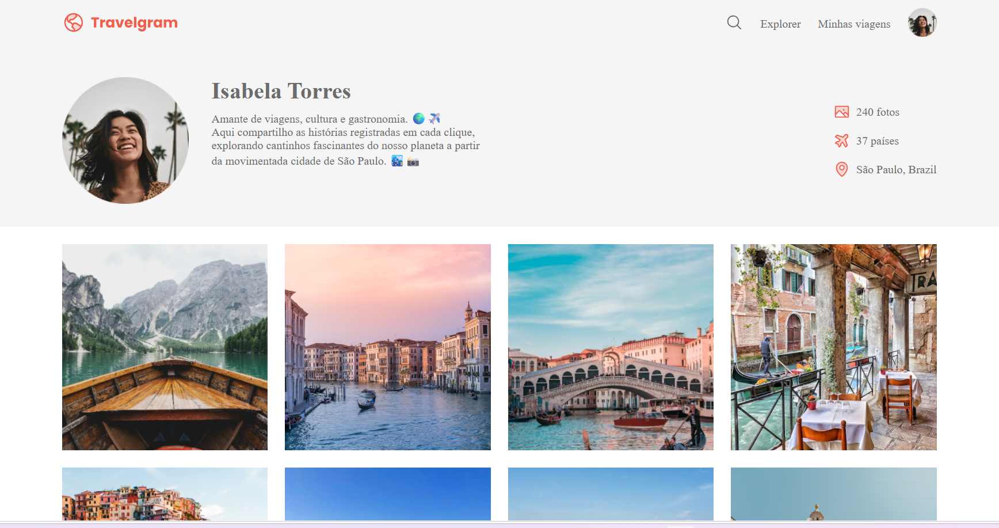

<h1 align="center"> Travelgram </h1>

  

## Sobre o projeto
O projeto apresenta um perfil de viajante com informações pessoais, estatísticas de viagens e uma galeria de destinos, explorando diferentes técnicas de organização e distribuição de elementos na página e foi desenvolvido como parte dos estudos nas aulas de grid da Rocketseat.

## Objetivo
O objetivo do projeto foi aprofundar os conhecimentos em CSS Grid e Flexbox, entendendo como essas ferramentas podem ser utilizadas em conjunto para construir layouts modernos, organizados e visualmente consistentes.

## Aprendizado 
Este projeto faz parte da minha jornada de aprendizado e contribuiu principalmente para o desenvolvimento de CSS Grid, Flexbox, variáveis CSS e implementação de layouts a partir de designs no Figma, representando a prática de conceitos fundamentais de construção de interfaces com HTML e CSS.
  
## Tecnologias
- HTML - estrutura e semântica da página
- CSS3 - estilo e organização visual 
- Figma - referência visual do projeto 

## Como executar 
Abra o arquivo `index.html` no navegador.

